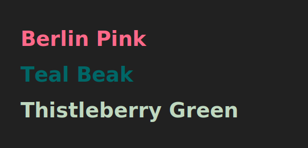

# __18303__ color-names


[](https://github.com/meodai/color-names/)
[](https://www.npmjs.com/package/color-name-list)
[](https://www.npmjs.com/package/color-name-list)
[](https://travis-ci.org/meodai/color-names)
[](https://github.com/meodai/color-names/blob/master/src/colornames.csv)
[](https://ko-fi.com/A530429S)

A handpicked list of __18303__ unique color names from [various sources](#sources-) and thousands of curated user submissions.

> The names of color function like a thread attached to a frightfully slender needle, capable of stitching together our most delicate emotions and memories. When the needle hits the target, we feel either pleasure or empathy. **Kenya Hara – White**

## About 📋

The aim of this project is to create as large a list of color names as possible while maintining a good name quality. We've merged various [lists](#sources-), modified the names when there were duplicates with different hex values, and shifted the colors a bit when there were identical colors with different names.

## Explore 🌍

- [Color Picker & Name Search] Click the wheel to get name for a color, or just use the full text search.
- [Color Picker]: Click the colored surface to change the color or type in a hex value below the name.
- [Color Picker II]: Move your mouse and scroll to choose a color.
- [Name Search]: full text search on the color list.
- [Color Distribution] 3D view of all color names in different color spaces.
- [Twitter Bot]: Posts random colors and lets you submit new ones.

## Color Name Submission 💌

**[via form 🌈](https://docs.google.com/forms/d/e/1FAIpQLSfbS5D6owA4dQupJJ-6qhRzuxkjX9r2AliPMg-VR2V3NpGkQg/viewform) / or [twitter 🐦](https://codepen.io/meodai/full/ZXQzLb/)**

Make sure to read the [naming rules](CONTRIBUTING.md) before you contribute!

## Color Count: __18303__ 🎉

~__0.11%__ of the RGB color space

## [Color distribution](https://codepen.io/meodai/full/zdgXJj/) 🛰


When coming up with new color names, it is vital to know what spots in a certain color-space are crowded and where there is still room for new colors. For example: Our API returns the closest `RGB` color to a given `HEX` value. To avoid too many colors snapping to the same name, we aim to distribute the colors evenly in the color space: [Visualization](https://codepen.io/meodai/full/zdgXJj/)

## Usage 📖
### Installation Node.js 📦
```shell
npm install color-name-list --save
```
or `yarn add color-name-list`

### CDN 🌍
[JSON](https://unpkg.com/color-name-list/dist/colornames.json) / [JSON.min](https://unpkg.com/color-name-list/dist/colornames.min.json) / [CSV](https://unpkg.com/color-name-list/dist/colornames.csv) / [YML](https://unpkg.com/color-name-list/dist/colornames.yaml) / [JS](https://unpkg.com/color-name-list/dist/colornames.umd.js) / [XML](https://unpkg.com/color-name-list/dist/colornames.xml) / [HTML](https://unpkg.com/color-name-list/dist/colornames.html) / [SCSS](https://unpkg.com/color-name-list/dist/colornames.scss) / [CSS](https://unpkg.com/color-name-list/dist/colornames.css)

### API 🃏
```url
https://api.color.pizza/v1/{{hexvalue without the #}},{{more comma separated values}}
```
#### Single Color
`curl` [https://api.color.pizza/v1/212121](https://api.color.pizza/v1/212121)

```javascript
{
  "colors": [{
    "name": "Lead",
    "hex": "#212121",
    "rgb": {"r": 33, "g": 33, "b": 33},
    "distance": 0, // its an exact match
    "luminance": 22.062320231562225,
    "requestedHex": "#212121",
  }]
}
```
#### Multiple Colors
`curl` [https://api.color.pizza/v1/212121,060606,ff0012,550055,123456](https://api.color.pizza/v1/212121,060606,ff0012,550055,123456)

#### All Named Colors
`curl` [https://api.color.pizza/v1/](https://api.color.pizza/v1/)

In this case colors is not an `object` but an `array` of `objects` sorted by color-name

#### Unique Color-Names
by adding `?noduplicates=true` every returned name will be unique. The closest color, that was not returned previously will be returned:
`curl` [https://api.color.pizza/v1/212121,212121?noduplicates=true](https://api.color.pizza/v1/212121,212121?noduplicates=true)

```javascript
{
  "colors": [{
    "name": "Lead",
    "hex": "#212121",
    "rgb": { "r": 33, "g": 33, "b": 33 },
    "luminance": 22.062320231562225
  },{
    "name": "Abaddon Black",
    "hex": "#231f20",
    "rgb": { "r": 35, "g": 31, "b": 32 },
    "luminance": 21.30621829419759
  }]
}
```

### Usage JS ⌨

#### Exact Color

```javascript
import namedColors from 'color-name-list';

let someColor = namedColors.find(color => color.hex === '#ffffff');
console.log(someColor.name); // => white

let someNamedColor = namedColors.find(color => color.name === 'Eigengrau')
console.log(someColor.hex); // => #16161d
```

#### Closest Named Color

Since there are 16777216 possible RGB colors, you might use a library such as [nearest-color] or [ClosestVector] to help you find the the closest named color.

```js
import nearestColor from 'nearest-color';
import namedColors from 'color-name-list';

// nearestColor need objects {name => hex} as input
const colors = colorNameList.reduce((o, { name, hex }) => Object.assign(o, { [name]: hex }), {});

const nearest = nearestColor.from(colors);

// get closest named color
nearest('#f1c1d1'); // => Fairy Tale
```

Alternative package: [ktree](https://github.com/caub/ktree)

**Note**: If you are looking for something visually more accurate, you could: use [DeltaE], or use the above snippet, combined with a transform from rgb to [ciecam02] scaled to 0-255.

[DeltaE]: https://github.com/zschuessler/DeltaE
[ciecam02]: https://github.com/baskerville/ciecam02

### Building 🔨

```shell
npm install && npm run build
```

See [package.json](package.json#L6) for more.

## Sources 🗒

### Sources: Names 📇

- Thousands of user submissions [Twitter](https://codepen.io/meodai/full/ZXQzLb/)/[Google Docs](https://docs.google.com/forms/d/e/1FAIpQLSfbS5D6owA4dQupJJ-6qhRzuxkjX9r2AliPMg-VR2V3NpGkQg/viewform)/[Github](#contributors-)
- [Wikipedia list of named colors] (2018-02-23)
- [CSS/HTML color names]
- [Werner’s Nomenclature of Colours]
- [ntc.js]
- [xkcd color survey list]
- [htmlcsscolor.com]
- [OSX Crayons]
- [Crayola crayon]
- [Thailand weekday colors]
- [Chinese heavenly creatures colors]
- [Military Paint]
- [Olympian god colors]
- Model Color Paints: [Vallejo](http://www.danbecker.info/minis/miniother/PaintCharts/VallejoModelColor.html)
- [Fictional Colors] (2018-05-09)
- Non English Transliterations: [Japanese](https://en.wikipedia.org/wiki/Traditional_colors_of_Japan), [Mandarin](http://www.fluentu.com/blog/chinese/2016/07/25/chinese-colors/), [Hindi](https://en.wikibooks.org/wiki/Hindi/Colors), [Persian](https://en.wikibooks.org/wiki/Persian/Phrasebook/Colors), [Russian](//github.com/AleksejDix)
- Multiple paint, print, nail polish, model paint color lists

### Sources: Color 🎨

- [12-Bit & 8-Bit color palettes]
- [Pico-8 color palette]
- [Some Android Arts palettes]

## Contributors 🦑

- [meodai] Initiator, maintainer, name creator &, tooling
- [Nirazul] Name creator & tooling
- [Metafizzy] Logo Sponsor 💖

### Color Namers

[Verena the naming overloard], [Jess the name wizzard], [Syl], [Stephanie Stutz], [Simbiasamba], [Jason Wilson], [Inês João], [Nick Niles], [Qwhex], [Ichatdelune]

## Disclaimer 👮🏾‍

In the process we try to remove all names that are offensive or racist, as well as protected brand names.
As some of the color names come from other lists, some bad ones might slip in. [Please report them], they will be removed as quickly as possible.

[Please report them]: https://github.com/meodai/color-names/issues/new?title=Bad%20color%20name

## Latest Color Names 🔖



<!-----------------------------------------------------------------------------
                               REFERENCE LINKS
------------------------------------------------------------------------------>


<!-- explore -->

[Color Picker & Name Search]: https://codepen.io/meodai/full/pXNpXe
[Color Picker]: http://codepen.io/meodai/full/mEvZRx/
[Color Picker II]: https://codepen.io/meodai/full/xWNNwN
[Name Search]: https://codepen.io/meodai/full/VMpNdQ/
[Color Distribution]: https://codepen.io/meodai/full/zdgXJj/
[Twitter Bot]: https://twitter.com/color_parrot

<!-- 3r party libraries & tools -->

[ClosestVector]: https://github.com/meodai/ClosestVector
[nearest-color]: https://github.com/dtao/nearest-color

<!-- people -->

[Ichatdelune]: https://www.reddit.com/user/Ichatdelune
[Inês João]: https://www.inesjoao.me/
[Jason Wilson]: https://github.com/SgiobairOg
[Jess the name wizzard]: https://twitter.com/_nutbird_
[meodai]: https://github.com/meodai
[Metafizzy]: https://metafizzy.co/
[Nick Niles]: http://nickniles.com/
[Nirazul]: https://github.com/Nirazul
[Qwhex]: https://github.com/qwhex
[Simbiasamba]: https://www.instagram.com/simbisamba/
[Stephanie Stutz]: https://www.behance.net/stephaniestutzart
[Syl]: https://twitter.com/Gypsy_Syl
[Verena the naming overloard]: https://github.com/yxklyx/

<!-- Sources: Names -->

[Chinese heavenly creatures colors]: https://en.wikipedia.org/wiki/Color_in_Chinese_culture
[Crayola crayon]: https://en.wikipedia.org/wiki/List_of_Crayola_crayon_colors
[CSS/HTML color names]: https://developer.mozilla.org/en/docs/Web/CSS/color_value
[Fictional Colors]: https://en.wikipedia.org/wiki/List_of_fictional_colors#Identified_fictional_colors
[htmlcsscolor.com]: http://www.htmlcsscolor.com/color-names-rgb-values/A
[Military Paint]: http://paintref.com/cgi-bin/colorcodedisplay.cgi?manuf=Military
[Werner’s Nomenclature of Colours]: https://www.c82.net/werner/
[ntc.js]: http://chir.ag/projects/ntc/
[Olympian god colors]: http://www.hellenicgods.org/colors-associated-with-the-olympian-gods
[OSX Crayons]: http://www.randomactsofsentience.com/2013/06/os-x-crayon-color-hex-table.html
[Thailand weekday colors]: https://en.wikipedia.org/wiki/Colors_of_the_day_in_Thailand
[Wikipedia list of named colors]: https://en.wikipedia.org/wiki/List_of_colors:_A%E2%80%93F
[xkcd color survey list]: https://blog.xkcd.com/2010/05/03/color-survey-results/

<!-- Sources: Color -->

[12-Bit & 8-Bit color palettes]: https://en.wikipedia.org/wiki/List_of_color_palettes
[Pico-8 color palette]: https://www.lexaloffle.com/bbs/?tid=2101
[Some Android Arts palettes]: http://androidarts.com/palette/

<!-- EOF -->
